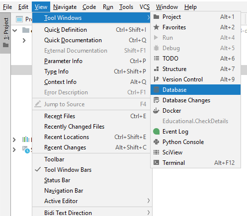
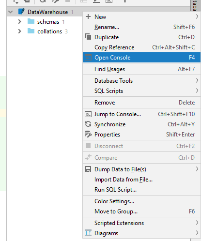
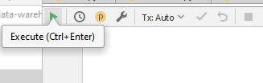

# Data Warehouse Practical

Charlie Witty & Brad Read

The following practical will get you to develop a simple data warehouse, adopting the star schema, within PyCharm using Python and SQLite, two languages you are familiar with. The first part of the practical will guide you though creating dimension tables and will lead onto you creating a fact table, the core of the data warehouse.

Before we get into any of the code, here is a reminder of what some of the terminology used in this practical means:

- Data Warehouse
<br>A term used to define a collection of data that helps analysts to make informed decisions in an organisation, often via the use of an OnLine Analytical Processing tools (OLAP). These allow us to analyse data in a multi-dimensional space.

- Star Schema
<br>In the Star Schema, the center of the star can have one fact table and a number of associated dimension tables. It is known as star schema as its structure resembles a star. The star schema is the simplest type of Data Warehouse schema.

- Dimensions
<br>Dimensions (thus the relational dimension tables) provide context to the facts. They are very important to the understandability of the data warehouse. Without dimensions, it would not be possible to understand the measures provided by the fact table because all labels and other descriptive information is sourced from the dimension table

- Dimension Table
<br>Dimension tables contain descriptive attributes (or fields) that are usually textual fields (or discrete numbers that behave like text); these attributes are designed to serve to be used as query constraining.

- Fact Table
<br>The fact table contains business facts (or measures), and foreign keys which refer to candidate keys (normally primary keys) in the dimension tables.


# Scenario

You are part of the UK's national school Computer Science Outreach organisation. The organisation's current information storage system is a collection of different tables that house basic information such as school details, staff details and Outreach session types.

The organisation wants you to create a fact table that combines the data from all their already existing tables (dimension tables) with some invoice data (already supplied to you). 

**Note**: This practical is quite different to how data warehouses are created in industry. Normally the data comes from all different sources that get updated continuously and not just from pre-made CSV files. The aim of this practical, however, is not to simulate a real life data warehouse but to help you understand the benefits of them and their variations.

---

## Creating mock Dimension Tables in Python using SQLite

Outline:
-	Import the SQLite library into Python.
-	Use SQLite commands in Python to create a database, dimension tables and a fact table.
-	Use SQLite commands to query the data warehouse and print the results of a query.


Clone/fork this repo into you portfolio space and ensure that you have the following files:

```
csc1033-data-warehouse-practical
├── Date_Dimension.py
├── Fact_Table.py
├── Main.py
├── ParseCSV.py
├── README.md
├── School_Dimension.py
├── Session_Dimension.py
├── Staff_Dimension.py
└── resources
    ├── Date_Data.csv
    ├── EduBase_Schools_July_2017_Data.csv
    ├── Fact_Data.csv
    ├── Session_Data.csv
    └── Staff_Data.csv
```

As you can see we have provided you with the structure for this data warehouse as well as some of the boilerplate code you will need. To increase the realism of this scenario, we have provided you with completed dimension tables that house historical data which organisations often archive and therefore, will often already be provided. The following practical will show you how to program dimension table and will task you with designing your own fact table.

# Creating Dimension Tables

For our data warehouse, we will need a number of dimension tables to describe the dimensions keys, values and attributes for this Outreach scenario. For example, the school dimension will contain the details/attributes of all the schools the organisation has worked with since it started.

Before we create any dimension tables, we need to make sure that we have a data source from which we are able to import the content for our tables. Luckily for you, we have provided you with multiple different `.csv` files with a range of the data for each dimension table you will need to create.

For the following example we will take you through the creation of the staff dimension table.

The first step is to select your data source by importing it into the the `Staff_Dimension.py` file. We do this by having a constant variable called `DATASET_FILE` and pointing it towards the appropriate `.csv` file found in the resources directory. At the same time, we have created a constant variable for the name of the table we are creating as this value will never change.

```python
import ParseCSV

DATASET_FILE = "resources/Staff_Data.csv"
TABLE_NAME = "StaffDim"
```

You may have also noticed that we are importing a file called `ParseCSV`. This will be used later in the code in order to parse the titles and columns from the `.csv` files containing the Outreach data. The first method tidies up the data by returning a parsed list of fields given a single CSV row i.e. it removes all `'` and `\n (new lines)` from fields. The second method returns a schema list when given a CSV title row and replaces all spaces with `_` removes all `'` and`\n (new lines)` as well as making all fields lowercase.

```python
def clean_row(row):
    return row.strip().replace("'", "").replace("\n", "").split(",")

def clean_title(title):
    return title.strip().replace("'", "").replace("\n", "").replace(" ", "_").lower().split(",")
```

## Create Statement

Now that we have access to the data source and we have written a parser to clean up our data, we can start creating the actual dimension table.

Here we want to define a new method called `create_table` in which we will pass a cursor object. As you may recall, cursor allows Python code to execute PostgreSQL commands in a database session. Cursors are created by the connection.cursor() method: they are bound to the connection for the entire lifetime and all the commands are executed in the context of the database session wrapped by the connection (see Main class for cursor and database initialisation).

We now need to read in data from the previously defined `.csv`, which in this case is `Staff_Data.csv`. We achieve this by defining a variable `file` which is used to open the `.csv` and make sure that it is only read in. If the file doesn't exist, this will also cause an exception to be thrown. We then use the built-in `readline` function to read in the data. Notice how this is passed through our parser for tidying up the rows titles and stored in a variable called `schema`.

```python
def create_table(cursor):
    file = open(DATASET_FILE, "r")
    
    schema = ParseCSV.clean_title(file.readline())
```

Now that we are able to read in the relevant data from the `Staff_Data.csv` we need to create a table using SQL commands, so that the data can be stored appropriately in a table.

Firstly, create a new variable which will be called when you want to create the table and then we add in f-strings for readability. f-strings `f""" sample text """` are used as a readable way of formatting strings. We then need to use the `CREATE TABLE` command to create a new table using our constant variable. Then in the brackets we choose which columns from the `.csv` file we want to add to the table. In this case `schema[0]` is saying we want to add a formatted version of the first title in `Staff_Data.csv` which is the `staff_key`. For each of these values we will also need to define their types e.g INTEGER, TEXT, SMALL INT, etc. Finally we use the `cursor.execute` command which executes these SQL statements on the SQLite database.

```python
create_table_statement = f"""
    CREATE TABLE {TABLE_NAME} (
        {schema[0]} INTEGER PRIMARY KEY,
        {schema[1]} TEXT,
        {schema[2]} TEXT,
        {schema[3]} TEXT,
        {schema[4]} TEXT,
        {schema[5]} TEXT,
        {schema[6]} TEXT
    )
"""
    cursor.execute(create_table_statement)
```

## Reading in Row Data

Now that we have created the table and have read in the column titles, we need to populate the table with the row data.

Once again we will use the readline function and check whether each row in the `.csv` is not null or an empty value **Note**: the first use of file.readline() is used to escape the column title schema.
If this is true then we define a new SQL statement which inserts the data from the `.csv` into the staff table and repeats this process for each row in the file `for _ in range(len(schema))`.
We then execute the insertion statement as well as the parsed data which has been read in.

```python
    line = file.readline()
    while line is not None and line != "":
        insert_statement = f"INSERT INTO {TABLE_NAME} (" + ','.join(schema) + ") VALUES (" + ",".join(
            ["?" for _ in range(len(schema))]) + ")"

        fields = ParseCSV.clean_row(line)
        cursor.execute(insert_statement, fields)

        line = file.readline()
```

That's it for this dimension table, luckily for us all of the other dimension tables follow almost the exact same styling and is coded in the same way. As such the above steps/ code can be reused for the other tables. 


# Creating a Main

In order to actually create the database, create the tables and populate them with data within PyCharm, we need to have a main class. Firstly, we need to import sqlite3 for our database as well as the dimension tables which need to be created.

```python
import sqlite3

import Date_Dimension
import Fact_Table
import School_Dimension
import Session_Dimension
import Staff_Dimension
```

Once we have our imports, we need to create a database connection and then a cursor which can be used for the given connection; in this case we are calling the database "DataWarehouse".

```python
def main():
    db_name = "DataWarehouse"

    connection = sqlite3.connect(db_name + ".db")
    cursor = connection.cursor()
```

Now we want to run a create_table command for each of the dimension tables we want to populate, making sure to pass through the cursor connection. This makes sure that the different dimension tables are connected to the database we have set up. We then run `connection.commit()` which sends a COMMIT statement to the sqlite database, committing the current transaction. Since by default Python does not autocommit, it is important to call this method after every transaction that modifies data for tables. The fact table is then created and committed in the same manner. Finally we close the cursor object otherwise Python will raise a ProgrammingError exception if any further operation is attempted on a closed cursor.

**Note**: that the `Fact_Table.create_fact_table(cursor)` line is commented out, this is because you will implemented it in the next section.

```python
    Date_Dimension.create_table(cursor)
    School_Dimension.create_table(cursor)
    Session_Dimension.create_table(cursor)
    Staff_Dimension.create_table(cursor)

    # Create dimension tables
    connection.commit()

    # Fact_Table.create_fact_table(cursor)

    connection.commit()
    connection.close()


if __name__ == "__main__":
    main()
```

# Task: Create an Invoice Fact Table

Creating a fact table is the easy part as all the data and the schema is already there for you, you just need to decide what data to measure in the fact table. In our scenario, the Outreach organisation wants to have some invoice data such as a particular session's price and rating. This data is provided to you in the `Fact_Table.csv`.

You task here is to create and populate the fact table using the same methods used in the dimension table `.py` files. Remember that you need to create the fact table slightly differently by using [foreign keys](https://www.w3schools.com/sql/sql_foreignkey.asp). These foreign keys are what is going to make querying easy.

From a literal standpoint, these foreign keys may make the fact table look undescriptive and not helpful but this is actually the design choice.  Fact tables are designed to a low level of uniform detail (referred to as "granularity" or "grain") with the aim of keeping data storage low and making queries as simple as possible.

Read, parse and insert the data from the `Fact_Table.csv` file into a database table.

# Queries

This is where we will see the usefulness of fact tables. 

## Running SQLite Queries in PyCharm

You can execute queries in PyCharm by first viewing the database in the Database pane (remember you will need to create the and populate the database first by running `Main.py`.). View the database by doing the following: `View -> Tool Windows -> Database`. 



You can write queries in PyCharm for a database through the database's console. You can access the console by doing the following: `Right click database in database pane -> Open Console (F4)`.



Finally you execute queries from a console session by `Clicking on green play button in top left of console` or pressing `Ctrl + Enter`.



**Note**: if you are receiving an error when trying to perform the above, you may need to install SQLite drivers. Try doing the following steps:
- Select `View -> Tool Windows -> Database`.
- Right click the database in the right pane and select `Properties`.
- At the bottom of the `Properties` window, click `Download missing driver files`.

## Task:

Perform the following queries on the database using the fact table:

- Retrieve the first name, last name and workplace of staff that ran a session with that had a rating that was above 3.
- Retrieve the session theme and receipt code of all sessions that were priced over £100.
- Retrieve the name of schools who have had more than 1 session.
- Retrieve the date, rating, session theme, recommended class size and the price of sessions which were less than £100 and had a rating lower than 3.

If you used joins in your queries, one of the benefits you may have found is that star schema join-logic is generally simpler than the join logic required to retrieve data from a highly normalized transactional schema.<br>The star schema does also make the above queries easy using `WHERE` clauses.

Imagine trying to perform these queries if, for example, the invoice data was included in the session type table. The queries would have been much more complex to write as well as taking a substantial performance hit.

